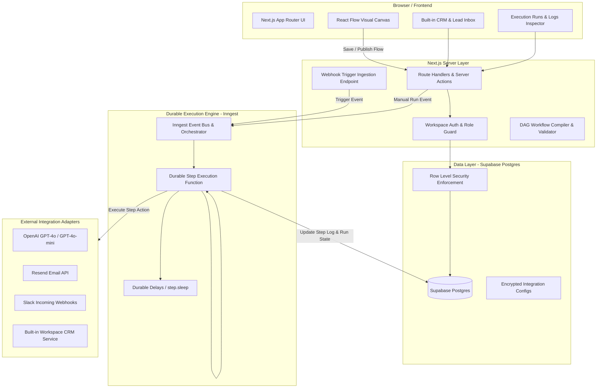
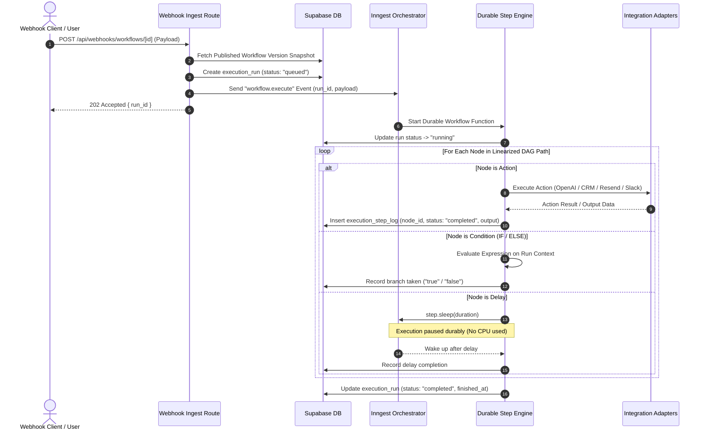

# FlowPilot AI — System Architecture

## 1. High-Level Architecture Overview

FlowPilot AI follows a modular, serverless architecture centered on durable workflow execution, workspace isolation, and typed integration boundaries.



---

## 2. Core Architectural Components

### 2.1 Visual Canvas (Frontend)
* **Framework:** React 19 + Next.js App Router + `@xyflow/react` (React Flow v12) + Tailwind CSS + `shadcn/ui`.
* **State Management:** Local canvas state with dirty checking, snap-to-grid, auto-layout helpers, and strict DAG graph validation before publishing.
* **Node Types:**
  1. `trigger_manual` (Manual test run with mock payload)
  2. `trigger_webhook` (Generates workspace-unique endpoint)
  3. `action_ai_qualify` (OpenAI prompt, structured schema, temperature)
  4. `action_crm_lead` (Create or update lead in workspace CRM)
  5. `action_send_email` (Resend email with subject, markdown body, recipient template)
  6. `action_slack_notify` (Slack webhook message block)
  7. `action_delay` (Durable timer: e.g. 15m, 2h, 24h, 3d)
  8. `condition_if_else` (Evaluates JSON path / expression into `true` or `false` branch)

### 2.2 Workflow Compiler & Graph Validator
* Workflows are saved as draft graph JSON (`nodes`, `edges`, `viewport`).
* Before publishing, the **Compiler** verifies:
  * Exactly one trigger node exists at the root.
  * No cycles exist (DAG validation via Topological Sort / Kahn's algorithm).
  * Every node has valid configurations matching its Zod schema.
  * Branches only spawn from `condition_if_else` nodes (into explicit `true` and `false` branches).
  * **Strict MVP Rule:** No branch merging (branches terminate independently).
* Once validated, an immutable **Workflow Version** is generated with a linearized step execution plan.

### 2.3 Durable Orchestration Engine (Inngest)
* Workflows are executed asynchronously through Inngest functions (`/api/inngest`).
* Each workflow node execution corresponds to a typed `step.run()` or `step.sleep()` call.
* **Why Inngest?**
  * Survives serverless cold starts and compute timeouts.
  * Delays of 24h+ do not consume server compute or block connections.
  * Automatic retries with exponential backoff for transient 3rd-party API errors (e.g. OpenAI rate limits or Slack 503s).
  * Atomic step memoization ensures idempotency and avoids double-emailing leads.

### 2.4 Security & Multi-Tenancy (Supabase + RLS)
* Every entity contains a `workspace_id` foreign key.
* Database queries use Supabase client with RLS enabled:
  * Application queries verify `auth.uid()` membership in `workspace_members`.
  * Service role client is strictly restricted to background Inngest worker runners and webhook receivers.
* Integration credentials (API keys, webhook URLs) are stored securely in `workspace_integrations` and never surfaced to client bundles.

---

## 3. Execution Dataflow & Step Lifecycle



---

## 4. Integration Adapter Layer

To ensure resilient testing and zero dependency on live paid accounts during development, all integrations implement a uniform adapter interface:

```typescript
export interface IntegrationAdapter<TConfig, TInput, TOutput> {
  execute(config: TConfig, input: TInput, context: ExecutionContext): Promise<TOutput>;
  validateConfig(config: TConfig): boolean;
}
```

* **Live Adapters:**
  * `OpenAIAdapter`: Uses `openai` Node SDK with JSON mode / structured outputs.
  * `ResendAdapter`: Dispatches transactional emails via `resend`.
  * `SlackAdapter`: Posts formatted payloads to Slack webhook endpoints.
* **Demo / Mock Adapters:**
  * Configurable in workspace settings (`demo_mode: true`).
  * Emulates deterministic realistic responses, logs outputs to execution step records, and prevents external API calls during testing.
