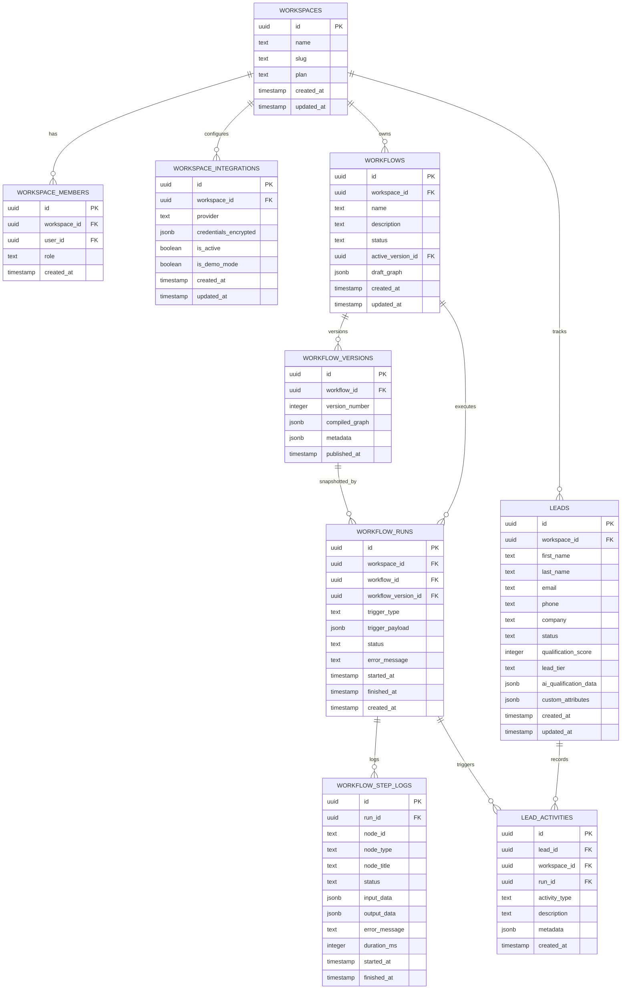

# FlowPilot AI — Data Model & Schema Specification

## 1. Entity-Relationship Overview (ERD)



---

## 2. Table Schemas & Definitions

### 2.1 Workspace & Multi-tenancy Tables

#### `workspaces`
Represents an isolated tenant boundary.
* `id`: UUID (Primary Key, default `gen_random_uuid()`)
* `name`: TEXT NOT NULL
* `slug`: TEXT NOT NULL UNIQUE
* `is_demo_mode`: BOOLEAN DEFAULT true
* `created_at`: TIMESTAMPTZ DEFAULT now()
* `updated_at`: TIMESTAMPTZ DEFAULT now()

#### `workspace_members`
Links Supabase `auth.users` to a workspace with role-based access.
* `id`: UUID (Primary Key, default `gen_random_uuid()`)
* `workspace_id`: UUID NOT NULL REFERENCES `workspaces(id)` ON DELETE CASCADE
* `user_id`: UUID NOT NULL REFERENCES `auth.users(id)` ON DELETE CASCADE
* `role`: TEXT NOT NULL CHECK (`role` IN ('owner', 'admin', 'member'))
* `created_at`: TIMESTAMPTZ DEFAULT now()
* UNIQUE(`workspace_id`, `user_id`)

#### `workspace_integrations`
Encrypted integration keys and provider configs per workspace.
* `id`: UUID (Primary Key, default `gen_random_uuid()`)
* `workspace_id`: UUID NOT NULL REFERENCES `workspaces(id)` ON DELETE CASCADE
* `provider`: TEXT NOT NULL CHECK (`provider` IN ('openai', 'resend', 'slack', 'webhook'))
* `credentials_encrypted`: JSONB DEFAULT '{}'::jsonb
* `is_active`: BOOLEAN DEFAULT true
* `is_demo_mode`: BOOLEAN DEFAULT false
* `created_at`: TIMESTAMPTZ DEFAULT now()
* `updated_at`: TIMESTAMPTZ DEFAULT now()
* UNIQUE(`workspace_id`, `provider`)

---

### 2.2 Workflow & Versioning Tables

#### `workflows`
Represents a workflow definition container.
* `id`: UUID (Primary Key, default `gen_random_uuid()`)
* `workspace_id`: UUID NOT NULL REFERENCES `workspaces(id)` ON DELETE CASCADE
* `name`: TEXT NOT NULL
* `description`: TEXT
* `status`: TEXT NOT NULL DEFAULT 'draft' CHECK (`status` IN ('draft', 'published', 'paused', 'archived'))
* `webhook_slug`: TEXT UNIQUE (workspace-unique endpoint slug for trigger)
* `draft_graph`: JSONB NOT NULL DEFAULT '{"nodes": [], "edges": []}'::jsonb
* `created_at`: TIMESTAMPTZ DEFAULT now()
* `updated_at`: TIMESTAMPTZ DEFAULT now()

#### `workflow_versions`
Immutable snapshot of a published workflow topology.
* `id`: UUID (Primary Key, default `gen_random_uuid()`)
* `workflow_id`: UUID NOT NULL REFERENCES `workflows(id)` ON DELETE CASCADE
* `version_number`: INTEGER NOT NULL
* `compiled_graph`: JSONB NOT NULL (Compiled DAG with normalized nodes, branching table, and action definitions)
* `published_at`: TIMESTAMPTZ DEFAULT now()
* `published_by`: UUID REFERENCES `auth.users(id)`
* UNIQUE(`workflow_id`, `version_number`)

---

### 2.3 Execution Engine Tables

#### `workflow_runs`
Tracks single workflow execution instances.
* `id`: UUID (Primary Key, default `gen_random_uuid()`)
* `workspace_id`: UUID NOT NULL REFERENCES `workspaces(id)` ON DELETE CASCADE
* `workflow_id`: UUID NOT NULL REFERENCES `workflows(id)` ON DELETE CASCADE
* `workflow_version_id`: UUID NOT NULL REFERENCES `workflow_versions(id)` ON DELETE RESTRICT
* `trigger_type`: TEXT NOT NULL CHECK (`trigger_type` IN ('manual', 'webhook'))
* `trigger_payload`: JSONB DEFAULT '{}'::jsonb
* `status`: TEXT NOT NULL DEFAULT 'queued' CHECK (`status` IN ('queued', 'running', 'waiting_delay', 'completed', 'failed', 'cancelled'))
* `error_message`: TEXT
* `started_at`: TIMESTAMPTZ
* `finished_at`: TIMESTAMPTZ
* `created_at`: TIMESTAMPTZ DEFAULT now()

#### `workflow_step_logs`
Granular step-by-step audit trail for each node in a run.
* `id`: UUID (Primary Key, default `gen_random_uuid()`)
* `run_id`: UUID NOT NULL REFERENCES `workflow_runs(id)` ON DELETE CASCADE
* `node_id`: TEXT NOT NULL (Canvas node identifier)
* `node_type`: TEXT NOT NULL
* `node_title`: TEXT NOT NULL
* `status`: TEXT NOT NULL CHECK (`status` IN ('pending', 'running', 'completed', 'failed', 'skipped'))
* `input_data`: JSONB
* `output_data`: JSONB
* `error_message`: TEXT
* `duration_ms`: INTEGER
* `started_at`: TIMESTAMPTZ
* `finished_at`: TIMESTAMPTZ

---

### 2.4 Built-in CRM Tables

#### `leads`
Built-in lead management records populated by workflows or manual entry.
* `id`: UUID (Primary Key, default `gen_random_uuid()`)
* `workspace_id`: UUID NOT NULL REFERENCES `workspaces(id)` ON DELETE CASCADE
* `first_name`: TEXT
* `last_name`: TEXT
* `email`: TEXT NOT NULL
* `phone`: TEXT
* `company`: TEXT
* `status`: TEXT NOT NULL DEFAULT 'new' CHECK (`status` IN ('new', 'contacted', 'qualified', 'unqualified', 'converted', 'closed'))
* `qualification_score`: INTEGER CHECK (`qualification_score` BETWEEN 0 AND 100)
* `lead_tier`: TEXT CHECK (`lead_tier` IN ('hot', 'warm', 'cold', 'unqualified'))
* `ai_qualification_data`: JSONB DEFAULT '{}'::jsonb (Summary, reasoning, budget estimate, timeline)
* `custom_attributes`: JSONB DEFAULT '{}'::jsonb
* `created_at`: TIMESTAMPTZ DEFAULT now()
* `updated_at`: TIMESTAMPTZ DEFAULT now()

#### `lead_activities`
Timeline history of actions and interactions for a lead.
* `id`: UUID (Primary Key, default `gen_random_uuid()`)
* `lead_id`: UUID NOT NULL REFERENCES `leads(id)` ON DELETE CASCADE
* `workspace_id`: UUID NOT NULL REFERENCES `workspaces(id)` ON DELETE CASCADE
* `run_id`: UUID REFERENCES `workflow_runs(id)` ON DELETE SET NULL
* `activity_type`: TEXT NOT NULL CHECK (`activity_type` IN ('created', 'ai_qualified', 'email_sent', 'slack_notified', 'status_changed', 'note_added', 'delayed_followup'))
* `description`: TEXT NOT NULL
* `metadata`: JSONB DEFAULT '{}'::jsonb
* `created_at`: TIMESTAMPTZ DEFAULT now()

---

## 3. Row Level Security (RLS) Strategy

All tables have RLS enabled with a standard workspace membership check:

```sql
-- Helper function to check workspace membership
CREATE OR REPLACE FUNCTION is_workspace_member(ws_id UUID)
RETURNS BOOLEAN AS $$
  SELECT EXISTS (
    SELECT 1 FROM workspace_members
    WHERE workspace_id = ws_id
    AND user_id = auth.uid()
  );
$$ LANGUAGE sql SECURITY DEFINER;

-- Standard Policy Applied to all workspace-scoped tables:
ALTER TABLE workflows ENABLE ROW LEVEL SECURITY;

CREATE POLICY "Workspace members can view workflows"
  ON workflows FOR SELECT
  USING (is_workspace_member(workspace_id));

CREATE POLICY "Workspace members can modify workflows"
  ON workflows FOR ALL
  USING (is_workspace_member(workspace_id));
```
