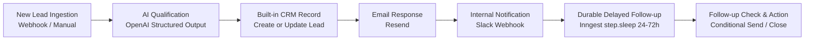

# FlowPilot AI — Product Scope Document

## 1. Product Overview & Vision
**FlowPilot AI** is an intelligent business automation platform engineered specifically for small businesses, agencies, and lean revenue teams. It bridges visual workflow automation with AI reasoning, enabling non-technical operators to build reliable, event-driven business flows that qualify leads, synchronize CRM records, trigger outbound communications, and manage long-running follow-up sequences without fragile glue code.

---

## 2. Target Audience & Problem Statement
* **Audience:** Small business owners, sales operations managers, marketing consultants, and small agency teams.
* **Core Problem:** Small businesses lose high-intent leads due to slow response times, lack of automated qualification, inconsistent CRM record creation, and forgotten multi-day follow-ups. Existing enterprise automation tools (Zapier, Make) either lack integrated AI-native decision gates, lack built-in lightweight CRM capabilities, or require complex configurations that lead to high maintenance costs.
* **Solution:** An intuitive visual workflow builder (React Flow) backed by reliable, serverless background orchestration (Inngest), OpenAI-powered intelligent qualification, built-in CRM records, and direct communication integrations (Resend, Slack).

---

## 3. Primary MVP Target Use Case

### End-to-End Walkthrough
1. **Trigger:** A new lead payload is received via a unique workspace Webhook URL (or triggered manually from the UI for testing).
2. **AI Qualification:** An OpenAI GPT model analyzes the lead content (budget, timeline, requirements, intent) and outputs structured data (`qualification_score`, `lead_tier`, `summary_tags`, `recommended_action`).
3. **CRM Synchronization:** The lead is automatically persisted in the workspace's built-in CRM (`leads` table) with structured metadata and status (`qualified`, `unqualified`, `needs_review`).
4. **Automated Response:** A personalized transactional confirmation email is dispatched via Resend using customized merge fields.
5. **Team Notification:** A formatted notification is broadcast to the team's Slack channel via Incoming Webhook with quick action details.
6. **Durable Delayed Follow-up:** An Inngest step pauses execution durably (e.g., 48 hours) without holding HTTP connections, running in-memory timers, or risking server restart interruptions.
7. **Follow-up Sequence:** If the lead has not converted or replied, a reminder email or secondary task is generated.

---

## 4. MVP Boundaries & Explicit Constraints

| Dimension | MVP Boundary (Phase 1) | Post-MVP / Future Roadmap |
| :--- | :--- | :--- |
| **Triggers per Workflow** | Exactly 1 trigger per workflow | Multiple triggers, scheduled cron triggers |
| **Workflow Topology** | Directed Acyclic Graph (DAG) only | Cycles, iterative batches |
| **Branching Structure** | Sequential actions + explicit IF/ELSE branches | Multi-path splits, parallel execution (AND joins) |
| **Branch Merging** | **Strictly prohibited** (Branches cannot merge back) | Merged paths, join barriers |
| **Execution Primitives** | Server-side execution only (Inngest steps) | Long-lived WebSocket sessions, edge execution |
| **Scripting / Logic** | Curated node types only (No arbitrary JS/Python) | Sandboxed custom code node runtime |
| **CRM Integration** | Built-in Workspace CRM only | Two-way Hubspot, Salesforce, Pipedrive sync |
| **Auth & Multi-tenancy** | Supabase Auth + strict Workspace RLS | Multi-provider enterprise SSO, RBAC per seat |
| **Billing / Monetization** | Open development mode (No billing enforcement) | Stripe subscription billing & usage metering |
| **Integrations Ecosystem** | Native Webhooks, OpenAI, Resend, Slack | Integration Marketplace, OAuth connection hub |

---

## 5. Non-Functional Requirements & Engineering Rules

1. **Multi-Tenant Isolation:**
   - Every single business record (workflows, executions, leads, logs, credentials) strictly belongs to a `workspace_id`.
   - Authorization is enforced both at the application layer (server actions / API routes) and the database layer (Supabase Row Level Security).
2. **Execution Integrity:**
   - Workflows execute entirely on the server via Inngest durable functions; never in client browser sessions.
   - Long delays (days/hours) rely exclusively on Inngest's durable step engine (`step.sleep` / `step.sleepUntil`). In-memory `setTimeout` or blocking HTTP connections are strictly banned.
3. **Immutability of Executions:**
   - Workflows are versioned upon publishing (`version_number`). Active executions run on immutable snapshot definitions so that in-flight workflows are never corrupted by canvas edits.
4. **Credential Security:**
   - API keys and webhook secrets are stored securely on the server and never sent to or displayed in the browser.
   - Integrations support both sandbox/demo adapters and live authenticated credentials.

---

## 6. Phased Delivery Plan

* **Phase 0 (Current):** Project initialization, architecture specification, data modeling, environment contract.
* **Phase 1:** Workspace setup, Supabase database schemas & RLS policies, Authentication integration.
* **Phase 2:** Visual Workflow Canvas (React Flow) with custom nodes (Webhook Trigger, Manual Trigger, AI Qualification, CRM Action, Resend Email, Slack Webhook, Delay, IF/ELSE Condition).
* **Phase 3:** Workflow compiler & Inngest execution engine (Durable Step Runner, Demo Adapters & Live Adapters).
* **Phase 4:** Built-in CRM module, Lead management UI, and Execution Run Inspector.
* **Phase 5:** End-to-end integration testing, sample templates, and deployment readiness.
